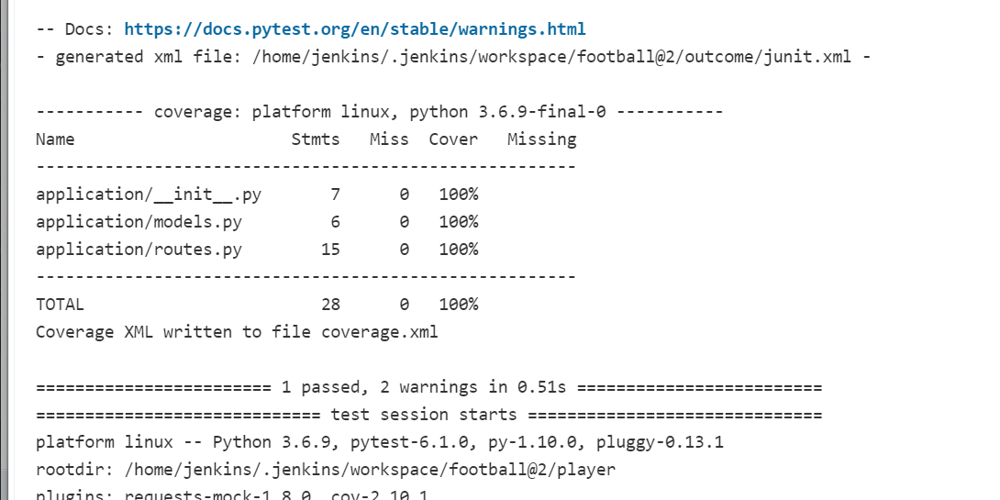
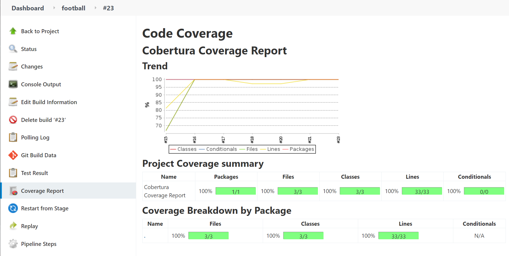

# Football Project (SFIA-2)

### Table of Contents
- [Brief](#brief)
- [Trello](#trello)
- [ED](#ED)
- [CI Pipeline](#ci=pipeline)
- [Services](#services)
- [Swarm](#swarm)
- [Risk Assessment](#risk-assessment)
- [Testing](#testing)
- [Testing Coverage](testing-coverage)
- [Fron End](#front-end)
- [Evaluation](#evaluation)

## Brief
My objective for this was to create a service-orientated architecture application which had to be composed of at least 4 services that work together. How it should work, the core service (service one) should render the Jinja2 templates that interacts with my application, it should also talk to the other 3 services and lastly it should keep some data in an SQL database. Service 2 and 3 should generate any random "object", which is where my creativity comes in for this project, Service 4, this service should also create an object however this object must be based on the random objects generated by service 2 and 3. The application must be built through a CI server, and deployed using containerisation, with an orchestration tool. Also the app must run using a reverse proxy, to allow user access.

Constraints
- Kanban Board: Asana or an equivalent Kanban Board
- Version Control: Git
- CI Server: Jenkins
- Configuration Management: Ansible
- Cloud server: GCP virtual machines
- Containerisation: Docker
- Orchestration Tool: Docker Swarm
- Reverse Proxy: NGINX

Some of the tools we are to use are:
- Docker
- Docker-Compose
- Docker-Swarm
- Ansible
- Jenkins Pipeline
- Git
- Github
- Nginx
- Flask
- Python
- VM (GCP)

For my project my idea was to create a player score generator that predicts if a player would score against a given team. My Core service will be responsible for showing this information, it'll also store the records in the database, which'll show the previous records of what player was given, what team what given and whether or not they will score. My second and third service were responsible for generating the players and the teams. I created my service 2 by putting several players into a list then selecting of those players at random which is passed onto service 4, same with service 3. My service for consist of a nested IF statement that assigned a player to a team and returned an outcome, will the player score or not.

## TRELLO
I started this project by creating a Kanban board on Trello, this allowed be to list out all of the things I needed to do in order to complete this project. I started this by writing out my user stories, then moved on to creating a "to-do" which I filled up with several cards, when I started working on that card it was moved onto the "Doing" list and the moved over to the "Done" list when completed. Below shows an image of my Trello board.

## ED
I set up a database that had 1 table and 3 rows, this was just to store the information.

## CI Pipeline

### V2

## SERVICES
The picture below shows how my services interact with each other, as you can see, service one connects to the other 3 services , service 2 and service 3 both generate random objects and sends it back to service 1, which is then sent to service 4 and the sent back to service 1 to display the outcome.

## SWARM
The swarm manager,  both workers and NGINX all run on separate VM's on GCP (Googles Cloud). How the swarm works starts with the manager, it pulls down the services and runs copies of them across to the workers. This exists so that the individual containers aren't overloaded by heavy traffic and so that if either server or any container stops working the app will continue to run. Nginx then acts as a reverse proxy so it's IP is where users will actually visit the web app keeping them from directly accessing the back end. It also directs which tasks will be used for each user balancing the load and making sure the containers are distributed appropriately.

## RISK ASSESSMENT

## TESTING
For my unit testing I tested all for services. The fist service was the only service that connects to the database, so I tested integration with the database making sure that if there was something in the database I could read what was in there. I then went on to testing the get response status was coming back as status 200. Lastly I tested the get request from the other 3 services were coming back with the correct information.
For service 2 and service 3, it was only a matter of making sure I was getting one of the random player names that I put in the object, so I took one of the players "Rashford" and made sure that name came out of the list, similarly for service 3, I gave the team "Liverpool" and did an assertEquals to check that the team I got back was Liverpool.
For service 4, it was a matter of going down the different paths for my if statement, so what I did was put the different set of players in a list, different set of teams in another list and then made a list of all the outcomes I could possibly have this way I could get all the players going up against all the teams and test that the result was correct.

## TESTING COVERAGE

### Service One Coverage

### Service Two Coverage

### Service Three Coverage

### Service Four Coverage

### Cobertura Coverage

## Front End

## EVALUATION
I think overall my application was a success as its successfully does what it askes off me and does that with all the rules that I had to follow. Although the app works I do feel like there are also places for some improvement, for starters given more time I would have added bootstrap which would have allowed me to have CSS and would have made my application look more appealing. One of the issues with my app is users have to refresh the page when they want to get a new player and a new team, something I could have done better would have been generating a button that automatically reloads the page and generates a new team and player. Apart from this I think overall the app is a success.

